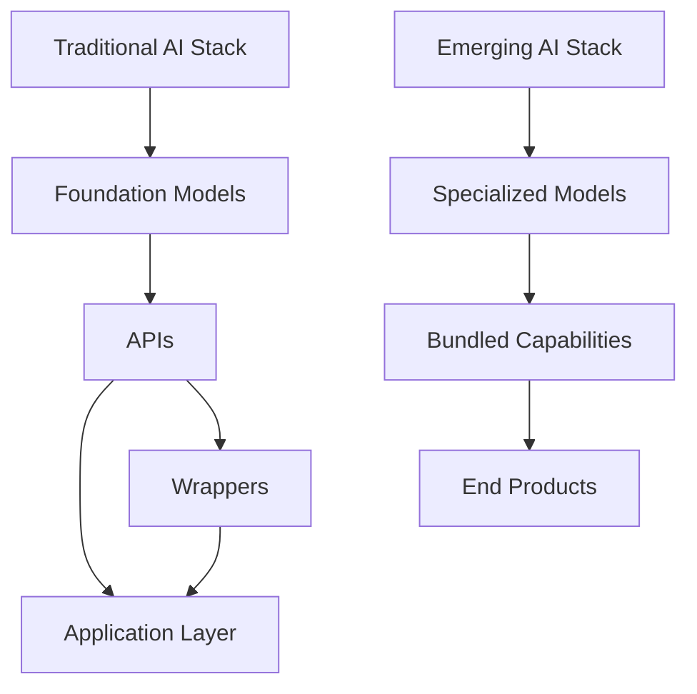
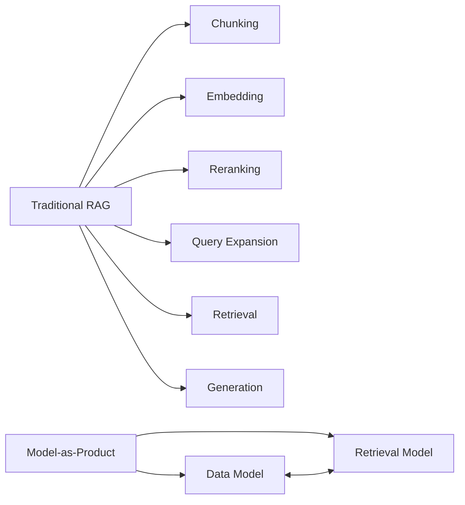

# The Convergence of Models and Applications

The artificial intelligence landscape is undergoing a fundamental shift as models and applications rapidly converge. This evolution is reshaping how we conceptualize AI products and services, with profound implications for the industry's future.

## The Traditional AI Stack vs. The New Reality

The conventional wisdom that separated model providers from application developers is being upended. As the article "The Model is the Product" highlights, major AI labs are increasingly integrating vertically, embedding specialized capabilities directly into their models rather than relying on external orchestration.



This isn't merely a strategic pivot – it represents a structural transformation of the AI ecosystem.

## The Counterintuitive Economics of Inference

Falling inference costs, counterintuitively, enhance rather than diminish model importance. When computation becomes cheaper, the incentive grows to offload more functionality directly into models, embedding complex capabilities that previously required elaborate workflows.

```python
# Traditional approach: External orchestration
def search_information(query):
    # Step 1: Generate search queries
    search_queries = llm.generate(f"Generate search queries for: {query}")
    
    # Step 2: Fetch results using external search API
    results = search_api.search(search_queries)
    
    # Step 3: Parse and analyze results
    parsed_results = []
    for result in results:
        analysis = llm.generate(f"Analyze this result: {result}")
        parsed_results.append(analysis)
    
    # Step 4: Synthesize final response
    final_response = llm.generate(f"Synthesize these analyses: {parsed_results}")
    return final_response

# New approach: Internalized search capabilities
def deep_research(query):
    # All search logic is embedded in the model itself
    return deepresearch_model.generate(query)
```

DeepResearch exemplifies this trend, functioning not as a wrapper around existing models but as a purpose-built system that internalizes search capabilities.

## From General to Specialized

Generalist scaling appears to be reaching diminishing returns, pushing frontier labs toward opinionated training. Models are evolving from general-purpose tools into specialized products with bundled functionalities.

| **Approach** | **Example** | **Key Characteristic** |
|--------------|-------------|------------------------|
| General Model | GPT-4 | Broad capabilities across domains |
| Specialized Model | Claude 3.7 | Enhanced performance in coding |
| Workflow System | LlamaIndex | External orchestration of tools |
| Bundled Model | DeepResearch | Internal task execution |

Claude 3.7's focus on coding capabilities illustrates how models are being tailored for specific high-value domains.

## Integration and the New Stack

This shift creates an integration challenge that off-the-shelf models cannot adequately address. Purpose-built models designed for specific applications deliver superior performance, as evident in Claude Code and DeepSearch.



These aren't simply API interfaces – they represent a new paradigm where models themselves constitute a critical layer in the application stack.

## The Strategic Dilemma

Application developers now face a stark choice: develop training capabilities or risk being trained on. Those who merely wrap existing models find themselves conducting free market research for the labs that supply their core technology.

```javascript
// Wrapper approach (increasingly vulnerable)
async function generateResponse(prompt) {
  const response = await api.callExternalModel({
    prompt: prompt,
    parameters: getOptimalParameters()
  });
  return processResponse(response);
}

// Training-enabled approach (more defensible)
async function generateResponse(prompt) {
  // Use proprietary small model for appropriate tasks
  if (shouldUseInternalModel(prompt)) {
    return internalModel.generate(prompt);
  }
  
  // Fall back to external API for other cases
  const response = await api.callExternalModel({
    prompt: prompt,
    parameters: getOptimalParameters()
  });
  return processResponse(response);
}
```

Meanwhile, successful wrappers like Cursor and WindSurf are scrambling to develop in-house models to maintain their competitive edge.

## The Investment Misalignment

The investment landscape has been slow to acknowledge this reality, continuing to favor application layers while undervaluing training capabilities. This market failure to price in reinforcement learning advances has created a funding environment misaligned with technological developments.

> "There is something deeply wrong in the current funding environment. Even OpenAI senses it now. Lately, there was some felt irritation at the lack of 'vertical RL' in the current Silicon Valley startup landscape."

## Conclusion: The Blurred Boundary

As models become products, the distinction between infrastructure and application blurs. The future belongs not to those who build atop models, but to those who can shape models to serve specific purposes – making models not just components of applications, but applications themselves.

---

*"At this stage, working only on applications is like 'fighting the next wars with last war generals'. I'm afraid we're at the point where many in the west are not even aware the last war is over."* – Quoted from "The Model is the Product"
